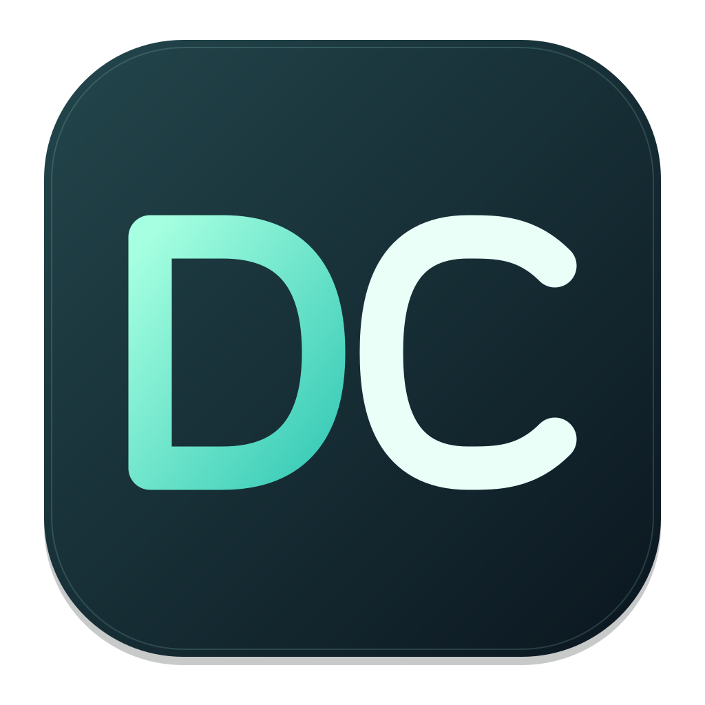
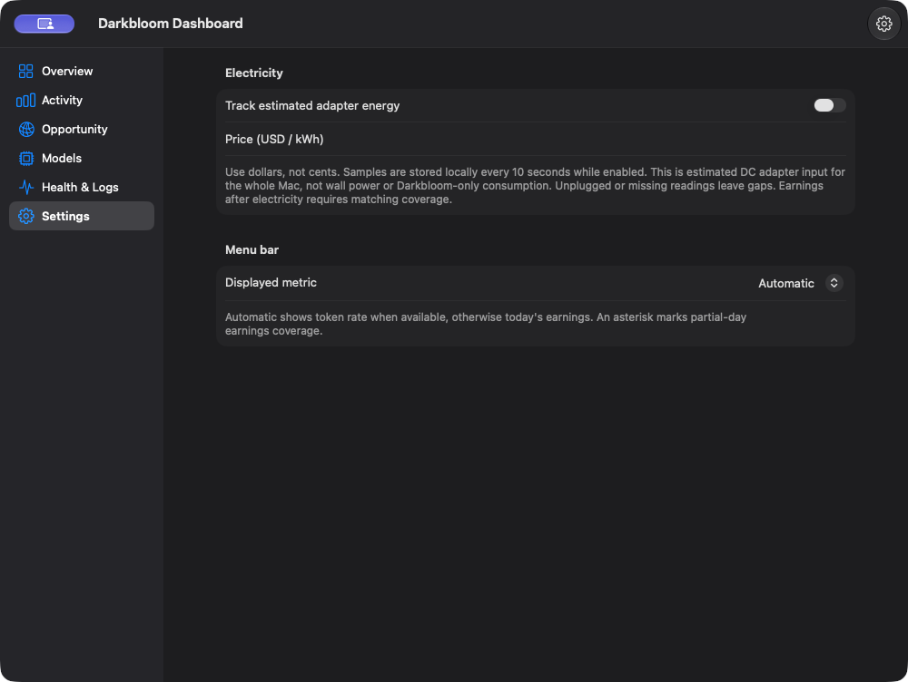

# Darkbloom Control



Darkbloom Control is a native macOS menu-bar companion for a local Darkbloom
provider. It turns provider telemetry into a compact infographic popup and
keeps model and lifecycle controls behind explicit safety checks.

> **Alpha software:** This project was previously named Darkbloom Monitor.
> This repository contains the rebranded source; older releases retain their
> original name. See [Releases](https://github.com/knightfolk/DarkbloomControl/releases)
> for published builds and their signing status.

## Highlights

- Menu-bar activity status with clearly labeled model-average throughput
- A compact, content-sized popup with short model pills and inline statistics
- Calendar-day average token throughput, including a per-model
  breakdown once more than one model has measured samples
- Calendar-day earnings, average earnings per observed hour, and a local
  calendar-week total
- Completed jobs today and the prior seven-day daily average when enough local
  history exists
- Green active, yellow loaded-idle, and gray available-model pills that remain
  visible during idle periods
- Start, Stop, and Restart controls with customer-impact confirmation when work
  is active or activity cannot be verified
- Model catalog management with separate Download, Delete, Enable, and Preload
  actions
- One-model Memory Saver and coordinator-visible two-model capacity modes
- Current per-model network demand for manual configuration decisions
- One resizable dashboard and Settings window
- Qwen, OpenAI/GPT-OSS and Google/Gemma menu-bar icons during observed activity
- Opt-in estimated adapter power, a saved USD/kWh electricity rate, and earnings
  after electricity for matching measurement periods

During inference, the status item shows the model's daily rate labeled `avg`, or
`Working` when no average exists. These are not realtime measurements. The popup
also labels this working/average fallback. Earnings remain the idle fallback.
Unavailable values are omitted or shown with a compact
neutral state; the monitor does not manufacture values from unrelated counters.

## Screenshots

Settings from an earlier local review build. Values vary by provider.



## Requirements

- macOS 14 or newer
- Swift 6 through Xcode or the Swift toolchain
- The official, unmodified Darkbloom CLI for provider data and controls
- `darkbloom login` for authenticated earnings

The telemetry and command contracts were last validated against Darkbloom
0.8.15. The monitor remains usable when Darkbloom is missing or stopped, but
affected live values and actions will be unavailable.

## Build and run

```bash
git clone https://github.com/knightfolk/DarkbloomControl.git
cd DarkbloomControl
swift test
swift run DarkbloomMonitor
```

For a release build:

```bash
swift build -c release
./.build/release/DarkbloomMonitor
```

You can also open `Package.swift` in Xcode and run the `DarkbloomMonitor`
scheme. The app appears only in the menu bar and intentionally has no Dock icon
or document window.

Each launch claims one user-scoped kernel lock before creating a status item.
A duplicate build using this same lock exits only the new process and does not
terminate the lock owner. Older builds predating this guard may still run beside
it. Rebuilding also does not replace an already-running process, even when its
executable path matches. See [the safe review-launch procedure](docs/REVIEW_LAUNCH.md).

## What it reads and stores

The monitor reads bounded local telemetry from:

- `~/.darkbloom/daemon-state.json`
- `~/.darkbloom/loaded-models.json`
- a bounded tail of `~/.darkbloom/provider.log`
- the local unified log for Darkbloom lifecycle, warning, and error events
- `darkbloom status`
- macOS thermal state
- authenticated Darkbloom account earnings and the public earnings leaderboard
- the public per-model network-capacity endpoint

The monitor does not use custom provider-control endpoints or require a patched
CLI. Model configuration changes take effect through the official CLI lifecycle.

It stores compact, user-only SQLite histories under:

```text
~/Library/Application Support/Darkbloom Monitor/
```

Those databases contain hourly earnings aggregates, changed balance samples,
observed uptime, and measured model token rates. They do not store the auth
token, account ID, provider key, prompts, responses, or per-job content.

Historical throughput is derived from positive token/time deltas belonging to
the same provider process and model. These completion counters are not a live
streaming rate. Calendar earnings include both inference
work and rewards. When retained data does not cover the entire current week,
the popup says **Observed this week** instead of presenting a partial value as a
complete weekly total.

## Provider controls and safety

Download, Delete, Enable and Preload are separate operations. Saved model
selection is passed explicitly at startup to bypass the CLI picker. Saving
configuration does not silently restart the provider.

One- and two-slot settings use the official provider configuration. Both slots
are coordinator-visible capacity. Manual live warming, staged replacement and
automatic demand-based switching are not supported by this app.

Stop and Restart require a customer-impact override when work is active or
activity is unknown. Delete requires fresh residency evidence. Quitting the
monitor stops its own work, not the provider.

After saving model configuration, restart the provider to apply it. The monitor
does not claim to verify the applied runtime configuration through private APIs.

## Limitations

- Consult the release notes for signing and notarization status of each artifact.
- Electricity is estimated whole-Mac DC adapter input, not wall power or
  Darkbloom-only consumption. Missing readings leave gaps; only fully matched
  earnings hours contribute to earnings after electricity.
- Earnings and model-rate history begin when this monitor collects it. Partial
  weekly coverage is labeled explicitly.
- A per-model throughput breakdown appears only after at least two models have
  valid measured samples for the current local calendar day.
- Darkbloom CLI output and APIs may evolve after the validated 0.8.15 contract.
- Only the official CLI is supported; do not install a custom provider branch
  to enable monitor features. Live streaming throughput and protected model
  switching are not available.
- Provider actions affect the local provider and may affect customer jobs; read
  confirmation dialogs before proceeding.

## Documentation

- [Telemetry contract](docs/TELEMETRY_CONTRACT.md)
- [Public API contract](docs/PUBLIC_API_CONTRACT.md)
- [Architecture](docs/ARCHITECTURE.md)
- [Electricity estimates and model icons](docs/ELECTRICITY_AND_MODEL_ICONS.md)
- [Presentation research](docs/PRESENTATION_OPTIONS.md)

## Development

Run the complete test suite and production build before submitting changes:

```bash
swift test
swift build -c release
```

The package targets macOS 14 and uses SwiftUI, AppKit, Swift Testing, and
SQLite3.
## Local review bundle assembly

After `swift build -c release`, assemble without launching or overwriting an
existing output (replace the absolute paths with your checkout paths):

```sh
python3 tools/package_app.py \
  --executable /absolute/checkout/.build/arm64-apple-macosx/release/DarkbloomMonitor \
  --resources /absolute/checkout/.build/arm64-apple-macosx/release/DarkbloomMonitor_DarkbloomMonitor.bundle \
  --output /absolute/checkout/.build/new-local-review \
  --version 0.1.0 --build-number 1
```

The new directory contains `Darkbloom Control.app` and a SHA-256 file manifest.
Version/build values are labels, not release provenance. This tool does not
launch, register, install, distribution-sign, notarize, or publish the app.
The manifest is not an SBOM or reproducible-build proof. Keep live relaunch,
unsaved-settings safety, upgrade testing and distribution approval separate.

## Upgrade from Darkbloom Monitor

Quit the old monitor before opening Darkbloom Control. Quitting the monitor
does not stop the official provider CLI. Keep only one installed app copy in
your chosen Applications folder; do not leave the old app as a second login item.

The bundle identifier, internal executable/resource names, settings keys,
history folder (`Library/Application Support/Darkbloom Monitor`), and
single-instance lock are intentionally unchanged. Existing settings and
history carry over without a migration. Swift package commands still use the
internal `DarkbloomMonitor` target name. The Git history and old release notes
retain the original project name for traceability.

See [Branding](docs/BRANDING.md) for editable icon sources and packaging details.
