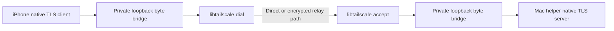

# Embedded Tailscale feasibility for the iOS companion

Date: 2026-09-25, America/Phoenix. Repository baseline: `14991f8`, `codex/models-window-grid`.

## Decision

**Conditional go for an embedded transport prototype; do not freeze onboarding or ship the tested dependency pin yet.** Embedding can remove the requirement to install Tailscale separately on the Mac and iPhone. It still requires authorizing each embedded application node in a tailnet. QR pairing establishes Darkbloom application trust and control permissions; it does not replace Tailscale enrollment.

Use a small Swift adapter over the official `libtailscale` C API, with native TLS retained above the route. Budget for narrow maintained Go/C changes if the dependency upgrade does not resolve logging/cancellation gaps. Do not adopt the current Swift stream wrappers unchanged. Keep external Tailscale as the accepted fallback. A product-owned internet relay is a separate service/operations project, not necessary to make this first companion work remotely.

The [design](../superpowers/specs/2026-09-25-ios-companion-design.md) and [12-task implementation plan](../superpowers/plans/2026-09-25-ios-companion.md) include monitoring, supported options, provider start/stop/restart, and Mac app quit/reopen/relaunch through a persistent per-user helper. These documents are proposals; this evaluation made no product source or live provider changes.

## Evidence obtained

Official source was checked out in `/tmp/darkbloom-tailscale-spike-20260925.o4wfUC/libtailscale` at [`59d4bb82744915815178e0f0776d60026a397ee7`](https://github.com/tailscale/libtailscale/tree/59d4bb82744915815178e0f0776d60026a397ee7). Its module pins Tailscale `v1.94.1` and Go `1.25.5`. The local build used Xcode `27.0 (27A266a)` and the module-selected Go toolchain. No production upstream source was changed; one isolated test was extended to check reverse traffic.

| Check | Observed result | Limit of the evidence |
|---|---|---|
| Mac C archive and Swift framework | Build passed, arm64, Mach-O minimum macOS 14.0 | Built on the current Mac; not executed on macOS 14. |
| iPhone C archive and Swift framework | Build passed, arm64, Mach-O minimum iOS 17.0 | Unsigned framework; no physical iPhone execution. |
| Simulator C archives and Swift framework | Build passed, arm64 + x86_64, minimum iOS 17.0 | Compile coverage; no simulator app launch. |
| Combined XCFramework | Assembly passed with Mac, iOS device and simulator platform identifiers | Unsigned packaging; not an app archive or distribution approval. |
| Upstream `TestConn` | Passed, including cleanup assertions | Synthetic loopback control and DERP/STUN; no real tailnet. |
| C API reverse-traffic extension | Passed: accepted descriptor sends a reply, dialed descriptor receives it | Small request/reply; no backpressure, cancellation, half-close, or TLS claim. |
| Physical-device availability | `devicectl` returned simulated devices only | Signed phone, permissions, cellular and battery proof remain outstanding. |

The unsigned executable sizes were 24.92 MiB for Mac, 21.99 MiB for iOS device, and 45.60 MiB for the universal simulator framework. These are local framework-file sizes, not installed-app growth, download size, runtime memory, or optimized App Store size.

The checked-in [manifest](../evidence/ios-companion/2026-09-25-embedded-tailscale/manifest.json) contains exact artifact sizes, SHA-256 hashes, local log paths/hashes, toolchain and test scope. The [test-only patch](../evidence/ios-companion/2026-09-25-embedded-tailscale/c-api-roundtrip.patch) makes the round trip reproducible. Framework binaries and full build logs remain outside the repository. No helper, persistent listener, or real tailnet node was installed by these checks; finite test servers shut down successfully.

## Findings that affect the implementation

1. **The C interface is the practical integration boundary.** `tailscale_dial` and `tailscale_accept` return descriptors that support both reading and writing. Source inspection and the request/reply extension agree. The supplied Swift `OutgoingConnection` exposes send only; `IncomingConnection` exposes receive only. They are insufficient as the complete byte transport for a TLS session. Sources: [C API](https://github.com/tailscale/libtailscale/blob/59d4bb82744915815178e0f0776d60026a397ee7/tailscale.h), [outgoing wrapper](https://github.com/tailscale/libtailscale/blob/59d4bb82744915815178e0f0776d60026a397ee7/swift/TailscaleKit/OutgoingConnection.swift), [incoming wrapper](https://github.com/tailscale/libtailscale/blob/59d4bb82744915815178e0f0776d60026a397ee7/swift/TailscaleKit/IncomingConnection.swift).
2. **The current OS floors are still credible, not runtime-proven.** Overriding the project deployment targets produced macOS 14/iOS 17 binaries. Swift listener/incoming APIs are explicitly gated to macOS 15/iOS 18, partly because of their typed `AsyncSequence` signatures. A C adapter can avoid that wrapper API dependency; actual minimum-OS device/runtime testing is still required. Do not raise Darkbloom's Mac floor solely because the sample defaults are higher.
3. **Shutdown and stream semantics need ownership in our adapter.** At the tested pin, `TailscaleNode.down()` calls `tailscale_up()`. `close()` does not clear its handle before deinitialization calls close again. The outgoing wrapper treats a short write as a terminal error, while incoming `readAll` treats a short read as a complete message, which TCP does not guarantee. Add explicit descriptor ownership, bounded read/write loops, cancellation, half-close and shutdown tests. These are source findings, not a claim that every case has been reproduced. See [node lifecycle](https://github.com/tailscale/libtailscale/blob/59d4bb82744915815178e0f0776d60026a397ee7/swift/TailscaleKit/TailscaleNode.swift).
4. **A resume strategy is required.** Upstream comments describe iOS reclaiming loopback listeners during suspension; `loopback()` caches an address, while `statusJSON()` was added to avoid relying on that HTTP listener. Our bridge should be created/revalidated on foreground resume, with a new authenticated session. A reconnect never repeats an accepted provider command.
5. **Do not promote the test pin directly into a release.** Its Tailscale `v1.94.1` dependency predates current releases and later security fixes. The official release listing showed `v1.102.4` during this review. The published bulletins include fixes for optional features such as Services, Serve/Funnel, SSH and routing; their existence alone does not prove this proposed restricted transport is exploitable. Update the dependency, review applicability and transitive components, and rerun the matrix before adoption. Leave those unused features disabled. See [releases](https://github.com/tailscale/tailscale/releases) and [security bulletins](https://tailscale.com/security-bulletins).
6. **The current logging control does not suppress all user logs.** `TsnetSetLogFD(-1)` sets `Server.Logf`, but leaves `Server.UserLogf` unset. At Tailscale v1.94.1, that defaults to `log.Printf`; `printAuthURLLoop` can print the interactive authorization URL. `TS_NO_LOGS_NO_SUPPORT=true` disables uploads, not this local output. Before a real login, configure/suppress both log paths through a reviewed Go/C change or an updated upstream API and add an authorization-URL canary test. Protect persistent node state separately from application pairing keys, with data protection and backup exclusion. Sources: [C bridge](https://github.com/tailscale/libtailscale/blob/59d4bb82744915815178e0f0776d60026a397ee7/tailscale.go#L515) and [pinned tsnet implementation](https://github.com/tailscale/tailscale/blob/v1.94.1/tsnet/tsnet.go).
7. **Cancellation must be demonstrated below Swift.** The C `up`/`dial` paths use an unbounded Go context; canceling a Swift task alone cannot stop that work. Start/close also have ordering requirements. Use a bounded worker and explicit node/descriptor ownership, then test blocked login/dial cancellation and resource cleanup. If that cannot be made reliable through the existing ABI, add a narrow cancelable Go/C interface before promotion. A timeout that only hides a still-running operation is insufficient.

## Proposed route and onboarding



The bridges forward TLS ciphertext to one fixed paired destination/service. TLS identity checks, client authentication and command authorization stay at the phone/helper endpoints. Loopback is not a trusted principal: an unpaired local process must fail mTLS. Do not expose a generic SOCKS proxy, arbitrary target parameter, Tailscale LocalAPI credentials, or inference endpoint through this bridge. Native Network.framework cannot simply be assumed to accept a library-owned descriptor; the loopback route itself is the next proof obligation.

Proposed user sequence:

1. Enable Companion in Darkbloom Control; register the per-user helper.
2. Scan the short-lived QR locally, compare the displayed code, and approve monitoring/control capabilities on the Mac.
3. Enable Remote Access and authorize the Mac helper's and iPhone app's Tailscale nodes using the user's tailnet. A separate Tailscale app should not be needed for the embedded route; confirm this on a real phone.
4. Reuse the same paired identities over LAN or Tailscale. Tailnet authorization and Darkbloom device revocation are displayed as distinct states.

This uses Tailscale's coordination/relay infrastructure. It is standalone from the user's app-install perspective, not independent of a networking service or account. A QR-only experience without user-managed tailnet authorization would require another enrollment/business model and service work. The official [tsnet documentation](https://tailscale.com/docs/features/tsnet) and [experimental Aperture example](https://github.com/tailscale/aperture-plus/tree/dba05551d3577825ecc44ca8dd0645c9eaca1f8c) support investigating app-contained connectivity, not promising App Store approval or unattended iOS background execution.

## Next bounded proof and acceptance criteria

Use synthetic telemetry and a fake command runner. Do not migrate real history or expose provider mutations to prove networking.

- Build a tiny signed iPhone/Mac harness carrying native TLS 1.3 through the C adapter/bridge. Prove exact host pin, required phone certificate, wrong/no certificate rejection, revocation and strict destination limits.
- Exercise stalled/partial writes, large frames, cancellation while dialing or awaiting login, ordered start/close, concurrent close, node restart, certificate renewal, and helper/UI separation. Track/close owned descriptors and verify underlying work terminates; measure bounded memory rather than inferring it from binary size.
- Prove authorization URLs and node credentials cannot enter local or uploaded logs. Resolve the `Logf`/`UserLogf` gap before interactive enrollment. The status JSON contains an `AuthURL` field; evaluate that in-memory API for initial login instead of assuming an IPN-bus/HTTP listener is mandatory.
- With user participation, authorize two test application nodes; prove actual cellular-to-Mac access, direct/relay fallback, expired/revoked node behavior, Wi-Fi changes, and another VPN enabled.
- On physical devices, measure foreground reconnect, suspended/locked behavior, idle memory and battery/network use. Recreate the bridge on resume; no background polling guarantee.
- Validate iOS 17/macOS 14 runtimes, signing/archive/privacy requirements, dependency notices and applicable service/distribution terms. Compilation is not distribution acceptance.

Promote embedding only after those checks pass with recorded artifacts. If it requires security exceptions or fails acceptable reconnect/resource behavior, keep the common pairing/control protocol and use external Tailscale for the first release.

Engineering judgment, not a delivery commitment: budget several focused engineering days for this remaining signed transport proof. Hardening/onboarding is additional work. The helper, single-writer migration and remote command policy are substantial work under every networking option; a product-owned relay adds a separate multi-week service and continuing operations.

## Reproducing the checks

Use a new temporary checkout; do not run these commands in the app repository or enroll real nodes. The pinned source is an experiment baseline, not a shipping dependency recommendation. Commands below run from the `libtailscale` checkout; `../` refers to its temporary parent.

```sh
git clone https://github.com/tailscale/libtailscale.git libtailscale
cd libtailscale
git checkout --detach 59d4bb82744915815178e0f0776d60026a397ee7

GOTOOLCHAIN=auto GOMAXPROCS=4 GOFLAGS=-p=4 MACOS_TARGET=14.0 make c-archive
GOTOOLCHAIN=auto GOMAXPROCS=4 GOFLAGS=-p=4 MACOS_TARGET=14.0 xcodebuild build -project swift/TailscaleKit.xcodeproj -scheme 'TailscaleKit (macOS)' -configuration Release -destination 'platform=macOS,arch=arm64' -derivedDataPath ../build-macos MACOSX_DEPLOYMENT_TARGET=14.0 CODE_SIGNING_ALLOWED=NO -jobs 4

GOTOOLCHAIN=auto GOMAXPROCS=3 GOFLAGS=-p=3 make c-archive-ios
GOTOOLCHAIN=auto GOMAXPROCS=2 GOFLAGS=-p=2 xcodebuild build -project swift/TailscaleKit.xcodeproj -scheme 'TailscaleKit (iOS)' -configuration Release -destination 'generic/platform=iOS' -derivedDataPath ../build-ios-device IPHONEOS_DEPLOYMENT_TARGET=17.0 CODE_SIGNING_ALLOWED=NO -jobs 2

GOTOOLCHAIN=auto GOMAXPROCS=3 GOFLAGS=-p=3 make c-archive-ios-sim
GOTOOLCHAIN=auto GOMAXPROCS=3 GOFLAGS=-p=3 xcodebuild build -project swift/TailscaleKit.xcodeproj -scheme 'TailscaleKit (Simulator)' -configuration Release -destination 'generic/platform=iOS Simulator' -derivedDataPath ../build-ios-simulator IPHONEOS_DEPLOYMENT_TARGET=17.0 CODE_SIGNING_ALLOWED=NO -jobs 3

GOTOOLCHAIN=auto GOMAXPROCS=2 GOFLAGS=-p=2 TS_NO_LOGS_NO_SUPPORT=true go test -run '^TestConn$' -count=1 -v -timeout 90s .

xcodebuild -create-xcframework -framework ../build-macos/Build/Products/Release/TailscaleKit.framework -framework ../build-ios-device/Build/Products/Release-iphoneos/TailscaleKit.framework -framework ../build-ios-simulator/Build/Products/Release-iphonesimulator/TailscaleKit.framework -output ../TailscaleKit.xcframework
```

Run the `go test` command once against unchanged source, then apply the checked-in `c-api-roundtrip.patch` with `git apply --unidiff-zero <path-to-patch>` to this exact pinned disposable checkout and run the test again. The zero-context patch avoids treating diff context markers as repository whitespace errors; its reverse applicability was checked against the tested source. `xcrun vtool -show-build` and `shasum -a 256` on each built framework executable produced the metadata in the manifest. The upstream Swift test suite was not run: its fixtures write application document paths and include an external proxy fetch; the bounded Go/C fixture provided more controlled evidence for this question.

## Independent review

GLM-5.3 (Max) completed a read-only ZCode review, titled **Embedded Tailscale companion feasibility review**, at approximately 22:49 local time. It independently inspected pinned upstream/source files and returned **Conditional-Go** for the C adapter/bridge prototype. It explicitly treated the builds, hashes and executed tests as Codex-reported evidence; Codex performed those checks. The review followed the [Friday routing skill](/Users/kevink/.agents/skills/friday-routing/SKILL.md).

Codex reconciled its findings against both `libtailscale` and the actual pinned `tailscale.com` module:

| Review finding | Checked disposition |
|---|---|
| Prefer the C byte transport; avoid asymmetric Swift stream wrappers | Accepted; source and synthetic reverse-traffic test support it. |
| No exported `tailscale_down`; define stop semantics in our adapter | Accepted. The plan now tests adapter-owned shutdown, not an imaginary corrected C function. |
| Close/cancellation TODOs require explicit resource ownership | Accepted as an unresolved proof obligation. Do not infer that all Go resources survive node close: `tsnet.Server.Close` actually closes listeners, netstack and other resources. C descriptors and in-flight operations still need tests. |
| `TailscaleNode.close`/deinit double-close could close a reused OS descriptor | Narrowed. A node handle is a generated map identifier, not an OS fd; repeat close returns `EBADF` after removal. Descriptor reuse risks belong to connection/listener ownership, not this specific node-handle claim. |
| Blocking listener read is an unconditional leaked thread | Not established. It waits on a socket until ownership ends; verify bounded lifetime/teardown instead of calling every waiting thread a leak. |
| Interactive authorization requires the IPN bus/loopback HTTP route | Too strong. `tailscale_status_json` returns `ipnstate.Status`, whose `AuthURL` can provide an in-memory source. End-to-end interactive login remains untested. |
| Wrapper availability forces iOS 18 on both ends | Narrowed. The incoming/listener types have that floor; an outgoing-only phone does not inherit it solely because the Mac accepts. Our C adapter avoids those specific wrapper types altogether. |
| Bridge looks sound, but physical TLS/WAN/suspension and updated dependencies gate promotion | Accepted as design reasoning, not executed proof. |

The review prompted deeper logging/cancellation inspection; the concrete `UserLogf` gap above was verified by Codex. No GLM-authored product edits or model-reported runtime results were treated as verified implementation.

Final local verification covered the three framework builds, XCFramework assembly, both bounded C tests, binary/log hashes, patch applicability, document links and staged whitespace. The existing Darkbloom app test suite/release build was not rerun for this documentation-only checkpoint. Physical-device and product-integration checks remain explicitly outstanding above.
