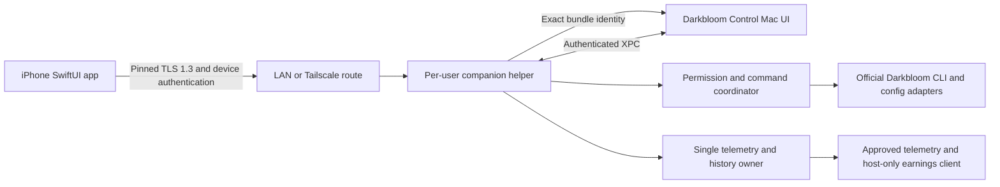

# iOS companion: QR pairing, monitoring, and remote control

Date: 2026-09-25. Status: researched proposal; no companion implementation exists yet.

Implementation baseline: `codex/models-window-grid`, commit `14991f8`. Repository inspected clean before this documentation work. Local build tools report Xcode 27.0 / Swift 6.4; the existing package declares Swift tools 6.0 and macOS 14.

## 1. Outcome and confirmed scope

Build a native iPhone companion for Darkbloom Control that pairs with a Mac by scanning a QR code and works on the LAN and remotely. Each installation has its own cryptographic identity. The phone can:

- Monitor provider status, models, measured performance, earnings, and data freshness.
- Change supported provider options, with explicit saved-versus-applied state.
- Start, gracefully stop, and restart the official provider CLI.
- Quit, reopen, and relaunch the paired macOS Darkbloom Control app while a background helper remains reachable.
- Forget a host; the Mac can revoke a phone or remove its control permissions immediately.

Kevin confirmed device-to-device security rather than a requirement to use Cloudflare Zero Trust. He accepted separate Tailscale clients for an initial release, then authorized an embedded-Tailscale evaluation with GLM as a research partner. Separate clients remain the agreed fallback. The [feasibility report](../../research/2026-09-25-embedded-tailscale-feasibility.md) records build/source/synthetic-test evidence and the remaining physical-device gate; operating a new cloud service is outside this scope.

The first milestone may be read-only to prove trust and telemetry, but the requested product includes controls. A read-only milestone is not completion of the request.

Proposed deployment floor: iOS 17 and macOS 14, retaining the current Mac floor. An embedded transport must prove those floors or produce an explicit compatibility decision. Do not copy an example app's higher OS floor without evidence that our integration requires it.

## 2. What the current repository provides

| Existing code | Reuse and required change |
|---|---|
| `Package.swift` | macOS-only telemetry library and SwiftUI/AppKit executable; Sparkle is a Mac dependency. Introduce portable companion products instead of importing the existing executable or telemetry collector on iOS. |
| `Sources/DarkbloomTelemetry/TelemetryService.swift`, `TelemetrySnapshot.swift`, `Availability.swift`, `TelemetryDeriver.swift` | Bounded collection, immutable snapshots, source freshness, and same-process rate derivation. Keep derivation on the host; create a separate network DTO allowlist. |
| `Sources/DarkbloomMonitor/MonitorStore.swift` | Owns earnings, history recording, uptime, aggregate model rates, and additional data missing from `TelemetrySnapshot`. Extract collection into one host runtime. |
| `Sources/DarkbloomMonitor/Dashboard/ProviderResourcesView.swift`, `SystemCPUUsageStore.swift`, `SystemGPUUsageStore.swift` | CPU/GPU sampling currently follows view lifetime. Move sampling ownership to the host runtime so the phone does not depend on an open Mac window. Preserve whole-Mac scope labels. |
| `Sources/DarkbloomTelemetry/ProviderControlService.swift` | Typed official CLI operations, fresh inventory validation, and reconciliation. Its actor gate serializes only one instance. It is not sufficient authorization for a network service. |
| `Sources/DarkbloomMonitor/ProviderControlStore.swift` | Active-work confirmation, comparison of saved/current models, settings serialization, and some startup/error reconciliation currently live in UI code. Move authoritative policy into the helper. |
| `Sources/DarkbloomTelemetry/ProviderConfigStore.swift`, `ProviderConfigDocument.swift` | Revision checks, candidate validation, private-file handling, atomic replacement, and preserved unrelated TOML. Retain these; apply typed patches to helper-owned drafts. |
| `Sources/DarkbloomTelemetry/ProviderExtrasClient.swift`, `Sources/DarkbloomMonitor/HostingSettingsStore.swift` | Existing idle/beta adapters and hosting capability/exposure checks. Route their mutations through the same coordinator as lifecycle/config work. |
| `Sources/DarkbloomMonitor/DarkbloomMonitorApp.swift`, `MonitorApplicationIdentity.swift`, `SingleInstanceGuard.swift` | Current composition and termination belong to the UI. Preserve Beta/production isolation and introduce a separate runtime ownership lock. |
| `tools/package_app.py`, `docs/RELEASING.md`, `docs/REVIEW_LAUNCH.md` | Existing Mac bundle/update workflow. Extend it for an embedded helper and agent plist; create a separate iOS signing/distribution lane. |

There is no production companion listener, QR pairing, device registry, Keychain identity, or XPC helper in the inspected sources. The current Hosting feature configures the CLI's inference endpoint. `HostingSettingsStore.swift` explicitly describes that endpoint as HTTP without TLS or rate limiting. The companion must use a separate service and must not export `.darkbloom/local_token`, `.darkbloom/auth_token`, account/provider keys, or arbitrary configuration text.

## 3. Connectivity choices and recommendation

| Route | What users install/do | Engineering and operation |
|---|---|---|
| External Tailscale | Tailscale on Mac and iPhone, authorize both nodes, then pair our apps | Lowest integration risk; existing clients own VPN/network lifecycle. iOS VPN conflicts are a real setup limitation. |
| Embedded Tailscale | Our Mac/iOS apps; authorize an embedded node on each side during onboarding | Moderate additional work: Go/C/Swift framework builds, node state protection, login, route integration, reconnect, memory/battery measurement, dependency updates. No separate Tailscale app is required for this mode. |
| Product-owned relay | Our apps and product enrollment; both connect outbound to our relay | Largest scope: relay/rendezvous, per-customer isolation, service authorization, resource limits, abuse protection, monitoring, cost, incident response, and availability. End-to-end encryption must remain between devices. |

Tailscale's official `tsnet` library embeds a userspace node, and `libtailscale` supplies a C bridge with Swift TailscaleKit builds for iOS/macOS. Its Swift documentation includes node authorization, dial/listen, and proxy support. This establishes a credible embedding path; it is not proof of our app's production readiness. See [tsnet](https://tailscale.com/docs/features/tsnet) and [TailscaleKit](https://github.com/tailscale/libtailscale/tree/59d4bb82744915815178e0f0776d60026a397ee7/swift).

The official [Aperture example](https://github.com/tailscale/aperture-plus/tree/dba05551d3577825ecc44ca8dd0645c9eaca1f8c) demonstrates app-contained connectivity without the system VPN and is described as experimental. Its higher OS targets and app-specific features are not requirements for Darkbloom. An embedded node still needs Tailscale authorization and network policy; embedding alone does not provide anonymous QR-only onboarding. Do not bundle reusable tailnet auth keys in the binary or QR code.

**Recommendation:** build the common helper, pairing, and control protocol with a transport boundary. Prove it first over LAN. Continue the embedded-Tailscale prototype using a small C API adapter and a bounded ciphertext bridge; promote embedding after physical proof below. The initial evaluation built macOS 14/iOS 17-targeted frameworks and passed a synthetic bidirectional C descriptor test. It did not prove native TLS bridging, real tailnet login, WAN access, or runtime on those minimum OS versions. Keep external Tailscale as a supported development/fallback route. Defer a product-owned relay unless eliminating Tailscale accounts becomes a product requirement.

Do not adopt the supplied Swift stream wrappers unchanged: their incoming/outgoing APIs are asymmetric, listener APIs require macOS 15/iOS 18, and the tested `down()` calls `up()` with no C `down` export. The tested source pins Tailscale `v1.94.1`, behind current releases and later security fixes; update/review the dependency before promotion. Resolve the separately verified user-log authorization-URL exposure and prove blocked dial/login cancellation; a Swift adapter may need narrow maintained Go/C changes. Detailed source links, artifact hashes, GLM review dispositions and limitations are in the feasibility report.

Tailscale can fall back from a direct path to encrypted relaying. Its relay service cannot decrypt WireGuard payloads; application mTLS still provides independent pairing and authorization. See [connection types](https://tailscale.com/docs/reference/connection-types) and [DERP](https://tailscale.com/docs/reference/derp-servers).

### Embedded transport feasibility criteria

The spike must demonstrate all of these, recording pinned source versions and actual results:

1. Build device, simulator, and Mac frameworks from a pinned `libtailscale` revision; inspect its bundled Tailscale/Go dependencies and update/security status before adoption. Build a signed physical-device app. Do not rely on an old sample issue as proof that current source is broken or fixed.
2. Authorize separate Mac/iPhone app nodes interactively in the user's tailnet without placing admin/reusable auth keys in the product. Revoke and reauthorize cleanly. Keep node state out of backups and logs.
3. Carry our native TLS connection through the embedded C API dial/listen descriptors without terminating inner TLS in a proxy. The proposed adapter is a bounded, single-destination loopback byte bridge: native `NWConnection`/`NWListener` owns TLS; the embedded stream forwards ciphertext. This is a design to validate, not a claim of a drop-in Network.framework socket adapter. Recreate/revalidate bridge listeners on foreground resume; test short writes, cancellation, concurrent close and half-close explicitly.
4. Enforce the same host pin, client identity, permissions, and revocation on direct LAN and embedded routes. A local bridge peer cannot obtain access without the paired key. No generic SOCKS service or arbitrary target forwarding is exposed by our app.
5. Recover after foreground/background transitions, Wi-Fi/cellular changes, NAT/relay fallback, node expiration, and host helper restart. Measure idle memory, reconnect latency, and battery/network activity on a real iPhone.
6. Confirm minimum OS/API availability, framework signing/archive validity, dependency notices, and applicable service terms for the intended distribution. An upstream statement that a framework is suitable for submission is not App Store acceptance of our app.

If any criterion fails, document the failure and use the already accepted external-client route. Do not replace pinned TLS with tailnet membership alone to make embedding work.

Planning estimates, not delivery promises: the embedded transport spike is several focused engineering days; hardening adds packaging and device-test work. A product-owned relay is a separate multi-week subsystem with continuing operations. The helper/control migration below is substantial under every route and is not included in those transport-only estimates.

## 4. Process architecture

The opt-in, non-root helper is a bundled per-user LaunchAgent registered through `SMAppService`. The UI explains its purpose, reports registration/approval status, and links to the relevant system setting when macOS requires approval. It survives the Control window/app closing. It does not imply service before user login or after logout. [Apple documents this bundle and registration model](https://developer.apple.com/documentation/servicemanagement/updating-helper-executables-from-earlier-versions-of-macos).

### One runtime and one provider mutation owner

- Extract `HostMonitoringService` from the current app composition. It owns telemetry acquisition, earnings polling, uptime/model-rate recording, energy history, extras, and host resource sampling. Mac and phone consume snapshots; their polling must not produce duplicate history rows.
- Keep current databases, history coverage, and preferences. The helper must use its verified parent app's storage/preferences namespace, not accidentally its own `UserDefaults.standard` domain. Production and DC Beta retain separate history/identity namespaces.
- Add a process-held runtime lock. When enabling the helper, the app quiesces collection, flushes and closes writers, releases ownership, then the helper acquires ownership and starts. A readiness acknowledgement completes the handoff. An XPC outage must not trigger a competing in-process collector.
- An in-process runtime can preserve existing behavior when companion mode is explicitly disabled. Switching back requires unregistering/stopping the owned helper, confirming release, then reacquiring the same lock. An uncertain handoff fails closed and preserves data.
- All participating Mac and phone provider mutations use one helper-owned `ProviderCommandCoordinator`. It wraps config, lifecycle, idle/beta, and relevant preferences; no UI path may bypass it in companion mode.
- Provider mutation ownership is keyed to the canonical provider config/user, across Beta and production. Beta must not start a second controller for the same provider. Default Beta companion testing uses fixture providers; production ownership is deliberate.
- Preserve existing revision and file-identity checks for external/manual CLI edits. Advisory locks coordinate cooperating software, not every possible writer.

XPC peers must validate signed code identity and intended channel in both directions, as well as the correct user context. Use the actual signing team and exact bundle identifiers from the build, not a broad same-team or process-name check. [Apple's `setCodeSigningRequirement`](https://developer.apple.com/documentation/foundation/nsxpcconnection/setcodesigningrequirement(_:)) is available within the Mac floor. Wire decoding is typed and bounded; a raw `execute(String)` XPC method is prohibited.

## 5. Trust model

Use zero-trust principles: being on the LAN, in a tailnet, at a known IP, or discovered by Bonjour grants no application access. Every session authenticates device identity; every operation checks current capabilities and device status. This follows the network-location principle in [NIST SP 800-207](https://csrc.nist.gov/pubs/sp/800/207/final); it is not a claim of enterprise zero-trust certification.

Threats covered: hostile Wi-Fi, spoofed discovery/DNS, unauthorized tailnet nodes, stolen/expired QR invitations, replayed commands, revoked phones on existing connections, malformed/oversized traffic, and conflicting clients. A compromised unlocked endpoint, malicious local administrator, or an owner approving a substituted QR is outside the protection claimed here. Network providers can observe connection metadata and deny service even though they cannot bypass application keys.

### Device identities and TLS

- TLS 1.3 through Apple's Network/Security frameworks; mutual certificate authentication after enrollment. Require client authentication explicitly: Apple's server default is false. See [peer authentication](https://developer.apple.com/documentation/security/sec_protocol_options_set_peer_authentication_required(_:_:)).
- Each host and phone generates its own P-256 key. Prefer Secure Enclave on supported hardware, with a separate development-only software-key mode for simulators. No silent production fallback. [Apple's key guidance](https://developer.apple.com/documentation/security/protecting-keys-with-the-secure-enclave) describes hardware generation and access control.
- Use per-device self-signed X.509 identities and pin SHA-256 of canonical DER SubjectPublicKeyInfo (SPKI), not an IP address or display name. These are app-local trust records; do not install a system-wide CA profile.
- Native trust evaluation must still validate the certificate profile, signature, validity, role/EKU, and exact enrolled public key. Use an isolated peer-specific anchor/policy; never an accept-all trust callback. Route names are discovery hints, while an application identity in the certificate is stable across routes. Apple's [local TLS identity guidance](https://developer.apple.com/documentation/network/creating-an-identity-for-local-network-tls) makes clear that custom trust evaluation is exceptional and must perform the checks itself.
- Validate identity creation/import end-to-end: Security `SecKey` → certificate → Keychain `SecIdentity` → native TLS. Apple's [swift-certificates 1.21.0](https://github.com/apple/swift-certificates/tree/1.21.0) supports `SecKey` and Secure Enclave private-key wrappers in source; its package requires Swift tools 6.1. Treat 1.21.0 as the candidate pin, subject to the compatibility/security spike; record the resolved lockfile.
- Disable TLS session resumption for v1 so fresh connections require certificates; disable/avoid early data. Authorization is also checked on every message and subscription publication. [Apple exposes a resumption switch](https://developer.apple.com/documentation/security/sec_protocol_options_set_tls_resumption_enabled(_:_:)); [TLS 1.3's original specification discusses early-data replay](https://www.rfc-editor.org/rfc/rfc8446#section-8).
- Phone transport keys: device-only, non-synchronizing, usable while unlocked. A separate command-approval P-256 key requires device-owner authentication for signatures. Host helper identity: device-only storage configured for unattended use after the user's first unlock; prove lock-screen behavior on the target Mac. No Face ID prompt on each telemetry poll.
- Certificate validity: proposed 90 days, renewing on the same key before expiry. Peers validate renewed self-signed certificates against the enrolled SPKI and profile. Key replacement requires local re-pairing in v1; never silently trust a changed key. Certificate validity follows wall time; invitation/command deadlines use the host `ContinuousClock` (including time asleep). Helper restart invalidates all invitations and unaccepted preparations; monotonic deadlines are never restored across runtime epochs.
- Missing/corrupt keys do not trigger automatic identity recreation under an old pairing. Report recovery required. Device identities are excluded from cloud backup/sync; restore or a new phone requires pairing again. Explicit unpair/reset deletes matching identities. Do not assume uninstall reliably deletes Keychain items.

## 6. QR enrollment

Initial pairing is local and owner-present. Normal use can subsequently be remote. There is no first-contact trust-on-first-use prompt based on whichever host answers discovery first.

1. In Mac Settings → Companion, enable the helper and choose **Pair iPhone**. The helper opens a temporary bootstrap listener, creates a 256-bit random secret and invitation ID, and shows a QR for 120 seconds. The host's monotonic deadline is authoritative.
2. Scan inside the companion with AVFoundation. QR data is a versioned `dc-pair:1:` payload containing host identity/pin, invitation ID/secret, expiry for display, and bounded local connection hints. Maximum encoded payload: 2 KiB. It contains no provider token, tailnet enrollment key, permanent password, or private key.
3. Connect to the temporary TLS bootstrap listener and verify the exact QR host pin **before** transmitting the secret. This listener supports enrollment only; it cannot return telemetry or dispatch commands.
4. The phone creates transport and command-approval keys. It presents their public identities and proves possession over a fresh host nonce bound to the invitation, both keys, and requested capabilities. Bootstrap TLS plus this application proof binds enrollment to the intended keys.
5. Both screens show a short comparison code derived from the full enrollment transcript. The Mac displays requested capabilities, identifies the proposed phone, and requires local confirmation. A device name alone is not identity. The comparison code is a human check, never a low-entropy authentication secret.
6. Persist the approved keys/capabilities and atomically consume the invitation. Only one competing attempt can succeed. Close the bootstrap listener and delete the secret. Expiry, cancellation, failure throttling, helper restart, or replacement of the QR invalidates the invitation.
7. The phone reconnects to the normal listener using mTLS. A lost final response is resolved by authenticated reconnection with the enrolled key; it must not reopen or reuse the invitation.

Only one invitation and one pending approval exist at a time. Allow at most five valid-secret enrollment attempts per invitation, close it on repeated failures, and use separate global/per-peer connection limits so invalid traffic cannot allocate unbounded state. A photographed live QR can enable an enrollment attempt; short expiry and explicit host approval are required protections, not a reason to call the QR harmless.

Pairing secrets never enter logs, analytics, crash annotations, clipboard, exports, or persisted QR image files. Initial enrollment does not support emailing/sharing the QR or accepting an arbitrary deep link from another app.

## 7. Authorization and controls

Capabilities are granted on the Mac: `monitor.read`, `provider.lifecycle`, `provider.settings`, `app.lifecycle`. Viewer gets only monitoring; Operator can receive the other three. Phone requests cannot grant capabilities or enroll another phone. The paired-device view supports renaming, per-capability removal, and full revocation. Revocation closes active sessions, removes subscription access, and invalidates prepared commands before the next dispatch.

| Requested surface | v1 behavior |
|---|---|
| Start provider | Official noninteractive start with saved model selection and validated saved hosting options. Confirm observed fresh startup; process launch alone is not provider readiness. |
| Stop provider | Native graceful drain, `darkbloom stop --timeout 600`, existing 630-second process bound. Show remaining requests/usage confirmation and distinguish draining from stopped. No automatic force kill. |
| Restart provider | Preserve the existing official service sequence and saved-state application behavior. Recheck current activity/model comparison and require explicit acknowledgement of possible customer impact. |
| Enabled/preloaded models, resident slots, concurrency | Typed patch against a helper-owned draft and expected config revision. Concurrency 1...24; resident slots use the existing positive-integer validation; preload must be enabled. Save and apply/restart are separate. |
| Idle memory policy | Existing keep-loaded/unload-after adapter and validated 0...10080-minute range; preserve exact official CLI meaning and restart-required state. |
| Existing beta options | Advanced section for the supported `gemma-prefill-layer18`, `gemma-weighted-r1`, and `mtp` controls, gated by actual CLI support. Preserve auto/unknown versus explicit values. |
| Electricity options | Existing rate/measurement preferences with the helper as canonical owner; preserve units, calculation scope, and history coverage. |
| Inference hosting | Show current/saved state. Remote changes may disable serving or change already-authorized settings without increasing exposure. New external binding, auth disablement, or token access/replacement remains local-only in v1. Promote existing capability/interface checks into host policy. |
| Mac app Open / Quit / Relaunch | Exact registered bundle and channel only. Quit through authenticated IPC; refuse unsaved drafts, pending local confirmations, updater conflicts, or an unresponsive app. Reopen through `NSWorkspace` using the verified containing bundle. Never `killall` or a caller-provided path. |

Model download/delete, arbitrary TOML edits, memory-reserve/fan setters, CLI installation/update, machine reboot/shutdown, and arbitrary shell commands are outside v1. These do not already exist as a general remotely safe options API. Unsupported options are visibly unavailable, not guessed from raw config.

### Prepare, confirm, execute, reconcile

1. The phone sends a typed proposal with `requestID` and expected settings revision. The coordinator checks capabilities, fresh sources, conflicts, and supported values, then returns `PreparedCommand` with host/device identity, runtime epoch, exact action/arguments, risk summary, revision, policy epoch, fresh nonce, command ID, and a 60-second host-enforced dispatch deadline. This is the approval window, not a limit on an accepted ten-minute graceful drain.
2. The phone renders that exact command and obtains device-owner authentication before signing it with its enrolled approval key. Sign a domain-separated, length-prefixed **exact JSON byte payload issued and retained by the host**; no reserialization is used for signature verification. Restrict decoded fields/actions and show the signed values, not a separate client-created description. This is a command authorization proof, not a new encryption/key-exchange protocol.
3. The host verifies signature, device/capability status, deadline, revision, and fresh activity immediately before dispatch. Changed risk or arguments requires a new preparation. Do not accept a reusable `confirmed: true` field. User-presence protection is locally enforced by the key; without attestation, do not claim the host proves which hardware produced it.
4. Persist the accepted operation and mark dispatch intent before running the official command. Duplicate `(deviceID, requestID)` or command IDs return the same operation; mismatching payloads fail. Provider mutations serialize globally among participating clients.
5. Return an operation ID promptly and stream/poll its progress. The helper continues already accepted work if the phone disconnects or the Mac UI closes. Reconnect queries the original operation; it does not issue a new Start/Restart automatically.
6. After a crash or ambiguous process outcome, reconcile authoritative state. A persisted dispatch intent is never blindly rerun. Use `succeeded`, `failed`, `draining`, or `outcomeUncertain`; never manufacture exactly-once CLI execution across crashes.

App lifecycle has a separate policy lane so quitting the UI need not cancel or wait ten minutes for a helper-owned graceful drain. It still has a journal and signed authorization. The UI detaches from helper work on quit; it no longer cancels that work. Local UI changes and remote provider operations share the same policy rules, with local XPC identity taking the place of phone authentication.

### Draft and recovery rules

Keep `ProviderConfigDraft` inside the helper: its private source-file state is necessary for safe save and cannot be reconstructed from a network DTO. Return an opaque draft ID/revision and allowlisted fields. Track active edit leases and refuse conflicting remote writes while the Mac has an active dirty draft. Expired/disconnected drafts remain based on their original revision and cannot overwrite a newer save without explicit conflict resolution.

Resetting the helper's identity revokes all pairings. Restoring old storage must not silently restore revoked access: persist a policy epoch with Keychain-bound identity and fail closed on registry/epoch mismatch. Local repair/re-pairing is the v1 recovery path. Loss of phone connectivity cannot undo a dispatched provider action; this must be clear in operation history.

## 8. Wire contract and data minimization

Native TLS carries a small custom framed application protocol: a four-byte big-endian length followed by a versioned JSON envelope. ALPN: `darkbloom-companion/1`. This avoids introducing a general HTTP server, WebSocket proxy, or browser surface. Transport framing is not custom cryptography.

Proposed envelope fields: `protocolMajor`, `messageType`, `requestID`, and a typed `payload`. Reject unsupported major versions, unknown command types, malformed lengths, invalid identifiers, duplicate security-sensitive JSON keys, and excessive nesting. Do not deserialize arbitrary class graphs.

| Contract | Contents / limits |
|---|---|
| `CompanionSnapshot` | `hostID`, `runtimeEpoch`, `sequence`, `generatedAt`, schema version, individual metric observations, provider/app/helper states, and supported capabilities. |
| Metric observation | Optional value, unit, scope, direct/derived provenance, source capture time, source age at send, availability, and fixed safe reason code. Omit unavailable values in normal UI; stale retained values retain their original timestamps. |
| Model summary | Validated model ID/name; separately enabled, advertised, resident, and active; host-derived rates with window labels. No invented task completion percentage. |
| Earnings/history | Bounded aggregates, currency, period boundaries, host time-zone identifier, observed coverage, and attribution scope. Current earnings are account-level, including model aggregates, while serving time/power are local. Do not label account earnings as this Mac's earnings or a mixed account/local rate as measured local income. No raw job rows, provider/account IDs, auth material, or database files. |
| `SettingsSnapshot` / `SettingsPatch` | Allowed typed options, saved/applied distinctions, supported ranges, draft ID and opaque revision. No filesystem paths or arbitrary TOML. |
| `PreparedCommand` / `OperationStatus` | Exact authorized action, bounded parameters, risk, expiration, operation state/progress and fixed safe errors. No arbitrary CLI output. |
| General limits | 256 KiB maximum frame; 16 KiB maximum command/preparation; 256 models; history up to 168 hourly buckets per request, paged; maximum JSON depth 16. |
| Resource limits | Eight enrolled phones; eight authenticated sessions; one stream per phone; newest-one snapshot buffer; eight aggregate pending TLS/bootstrap connections; 10-second handshake/partial-frame deadline. |
| Request policy | 10 requests/second per authenticated phone, burst 20; control proposals at most five/minute; one provider mutation at a time, return busy rather than an unbounded queue. |

Phone display freshness uses host-reported source age plus monotonic elapsed time since receipt, with connection/round-trip uncertainty treated conservatively. Phone wall-clock differences must not make old data fresh. The server rechecks its own sources for commands; phone display freshness never authorizes a mutation.

Collection retains existing cadence: local state/models approximately two seconds, status 30 seconds, authenticated earnings ten minutes; expensive/optional sources follow subscribed demand and existing settings. Network requests consume cached snapshots rather than triggering arbitrary CLI runs. Bound history requests and audit records; keep only sanitized audit metadata for 30 days with a 10,000-record cap, retaining unresolved operations separately until reconciled or explicitly resolved locally.

Raw provider logs and arbitrary diagnostic prose are excluded. Existing `EventPrivacy` filtering is useful locally but is not a guarantee that arbitrary text is safe to transmit.

## 9. Routing, iOS behavior, and usability

- Normal direct listener: proposed configurable port 49443, explicitly chosen LAN/tailnet addresses; no automatic port forwarding, Funnel, public HTTP, or wildcard exposure. Temporary LAN pairing listener: proposed port 49444 while the QR is active. Report conflicts rather than silently changing a pinned policy port. Embedded nodes use their own listener and a private loopback TLS bridge.
- Bonjour `_dccompanion._tcp` advertises only protocol/service hints and a random host ID, never invitation secrets or authorization. Bonjour is discovery, not trust. Remote route hints come from the authenticated host and configured tailnet name/address; mDNS is not assumed to cross the internet.
- Tailscale grants should restrict enrolled user/devices to the helper port. Existing broad grants remain effective until removed; adding a narrow rule alone does not narrow access. Pairing permissions remain required even when a grant allows traffic. See [grant syntax](https://tailscale.com/docs/reference/syntax/grants).
- Do not hardcode `en0`, `utun` indexes, or a single address family. Reconcile selected interface addresses and preserve the host pin across DHCP, VPN, and IPv4/IPv6 changes. If a selected interface disappears, stop that listener instead of broadening it.
- iOS needs a camera explanation and a local-network explanation; declare the specific Bonjour service. Ordinary browsing of that declared service does not require requesting unrestricted multicast. Test denied/re-enabled permissions on physical devices. See [TN3179](https://developer.apple.com/documentation/technotes/tn3179-understanding-local-network-privacy).
- Use app lifecycle to suspend streams in the background and reconnect/refresh on foreground. Background tasks and silent pushes do not guarantee an always-on dashboard. No promise of reliable push alerts/widgets in v1. See [Apple background strategies](https://developer.apple.com/documentation/backgroundtasks/choosing-background-strategies-for-your-app).
- Keep ATS protections for URLSession/public HTTPS. Network.framework is lower-level and requires explicit TLS policy; removing ATS restrictions is not the solution for local certificates. See [Apple's ATS guidance](https://developer.apple.com/documentation/security/preventing-insecure-network-connections).
- External Tailscale can conflict with another iOS VPN; explain that failure distinctly. Embedded userspace connectivity avoids requiring a system VPN for our own traffic but still needs physical-device routing proof. See [Tailscale's VPN limitations](https://tailscale.com/docs/reference/faq/other-vpns).
- Mac asleep, logged out, powered off, helper disabled, or FileVault awaiting first login means unavailable. Opening the UI remotely cannot power on the Mac or bypass login. Keychain lock and tailnet authorization failures receive explicit local-recovery guidance.

Suggested screens are an information architecture, not approved visual designs: Hosts → Overview, Models, Settings, Operations; Pairing scanner; host details and Forget. Overview clearly separates Provider, Mac app, Helper, and Connection. Controls appear beside the relevant state with pending/saved/restart-required feedback. Normal unavailable metrics are omitted; connection and command errors remain actionable. Review actual phone and Mac layouts before fixing visual style.

## 10. Verification, rollout, and rollback

Required proof includes:

- Wrong/no client certificate, wrong QR pin, altered QR, malformed certificate/profile, expired/reused invitation, simultaneous enrollment, wrong command key, modified/expired/replayed command, and revocation during an active stream/command preparation.
- Real phone QR scan, LAN permission denial/recovery, genuine cellular-to-host operation, NAT/relay fallback, IPv6, DHCP changes, wrong DNS/Bonjour identity, and OS sleep/lock/background transitions. A simulator or same-Wi-Fi test does not prove remote access.
- Safe stop while idle and while accepting work, ten-minute drain continuation, zero remaining requests while usage is still being confirmed, changed activity after confirmation, and provider startup requiring fresh evidence.
- Competing Mac/phone drafts, manual config edits, two helpers attempting ownership, duplicate lost-response retries, helper crash around dispatch/publication, and corrupt/missing/rolled-back identity state.
- Remote UI quit/reopen during a helper-owned drain; unsaved UI draft refusal; exact Beta/production target; helper disabled by macOS; app update and helper version compatibility.
- Single telemetry/history writer, unchanged historical values/coverage, secret-canary serialization, resource bounds/fuzzing, accessibility/Dynamic Type, and real rendered UI review.

Roll out through isolated fixtures, signed local Beta/physical-device builds, LAN monitoring, remote monitoring, provider settings/lifecycle, then app lifecycle and update/recovery tests. None of those internal milestones alone establishes a release. TestFlight/App Store, production helper activation, tailnet changes, and Mac Sparkle publication require their own deliberate release work; this planning task authorizes none of those external actions.

Rollback is feature-based: disable remote listeners, revoke/invalidate pending commands, finish or reconcile accepted operations, unregister only the owned helper, and hand telemetry ownership back under the lock. Preserve histories, local provider configuration, and evidence. Keep storage migrations backward compatible in v1. Do not downgrade to a pre-helper app while the helper still owns collection/commands, restore an old database over a live writer, or automatically stop the provider as part of uninstalling the companion.

## 11. First implementation stop point

Implement only the isolated identity/transport/helper feasibility milestone first. Demonstrate physical iPhone ↔ signed Mac helper pinned mTLS, QR enrollment/revocation, helper survival after UI exit, and embedded Tailscale routing viability using synthetic telemetry and a fake command runner. Record failures and the chosen remote route. Stop before real provider mutations, storage migration, or publication; those begin with the later explicitly scoped tasks in the implementation plan.

This stop point prevents a cryptographic or embedded-transport assumption from driving a broad host refactor before it has been demonstrated. The subsequent plan still includes every requested control and monitoring capability.
